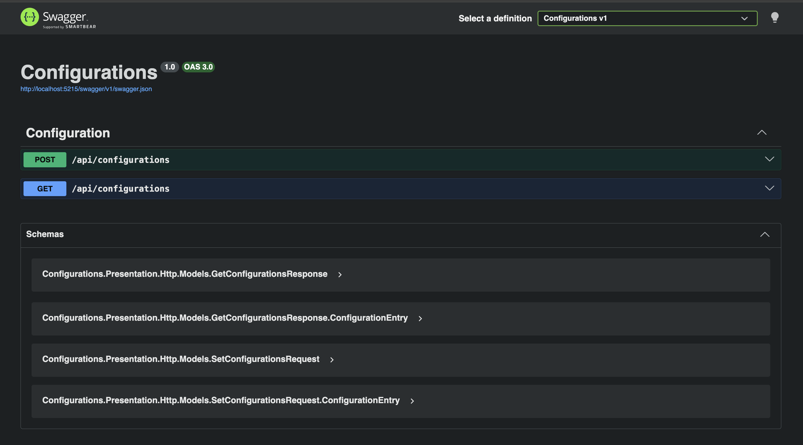
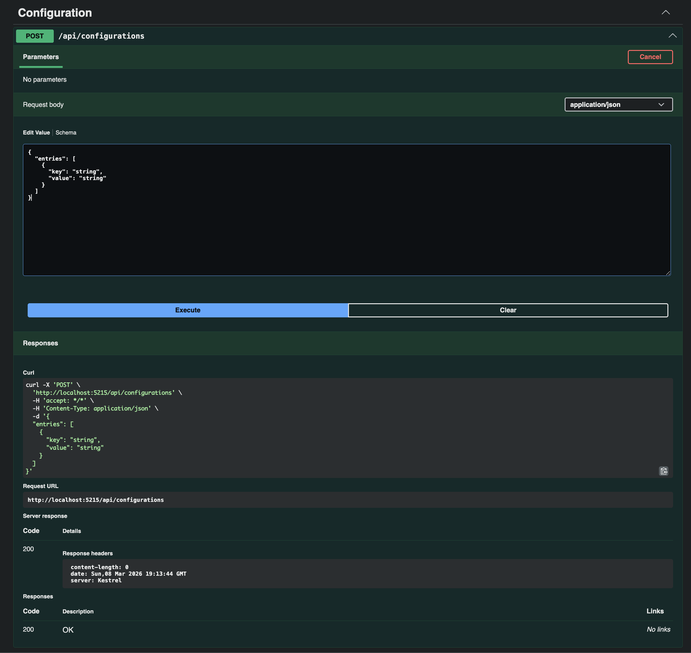
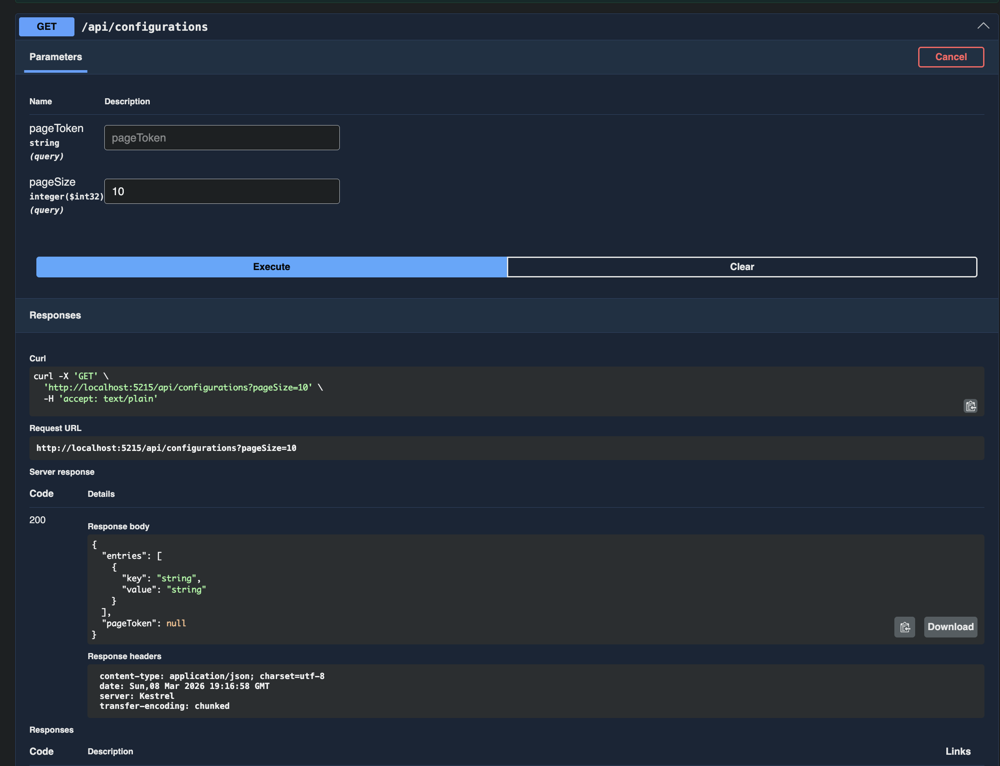

# Configuration Service (Lab 2 — API-first)

Сервис конфигураций с двумя методами:
- `POST /api/configurations` — сохранить/обновить набор конфигураций
- `GET /api/configurations` — получить конфигурации постранично

OpenAPI-спецификация лежит в репозитории: [`openapi.yaml`](docs/openapi.yaml)

---

## Требования
- .NET SDK 10

---

## Запуск
```bash
dotnet restore
dotnet run --project ./src/Configurations/Configurations.csproj
```

## Swagger
http://localhost:5215/swagger/index.html

## Примеры использования
### Swagger старница

### Post ручка

### Get ручка
