# Configuration Service (Labs 2-3-4-5-6)

## Оглавление / Table of Contents
- [Lab 2: Локальный запуск API](#lab-2-локальный-запуск-api)
- [Lab 3: Метрики и Grafana](#lab-3-метрики-и-grafana)
- [Lab 4: Логирование и LogQL](#lab-4-логирование-и-logql)
- [Lab 5: Трейсы и TraceQL](#lab-5-трейсы-и-traceql)
- [Lab 6: CI/CD](#lab-6-cicd)

Сервис конфигураций с двумя методами:
- `POST /api/configurations` - сохранить/обновить набор конфигураций
- `GET /api/configurations` - получить конфигурации постранично

OpenAPI-спецификация: [`openapi.yaml`](docs/openapi.yaml)

## Требования
- .NET SDK 10
- Docker + Docker Compose

## Lab 2: Локальный запуск API
```bash
dotnet restore
dotnet run --project ./src/Configurations/Configurations.csproj
```

- Swagger: [http://localhost:5215/swagger/index.html](http://localhost:5215/swagger/index.html)

### Скриншоты API
- Swagger страница  
  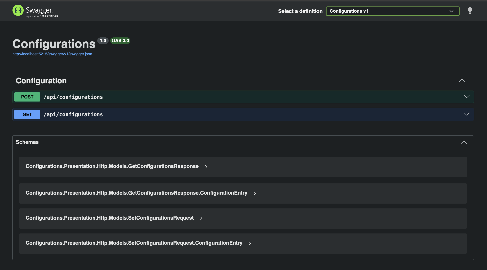
- `POST /api/configurations`  
  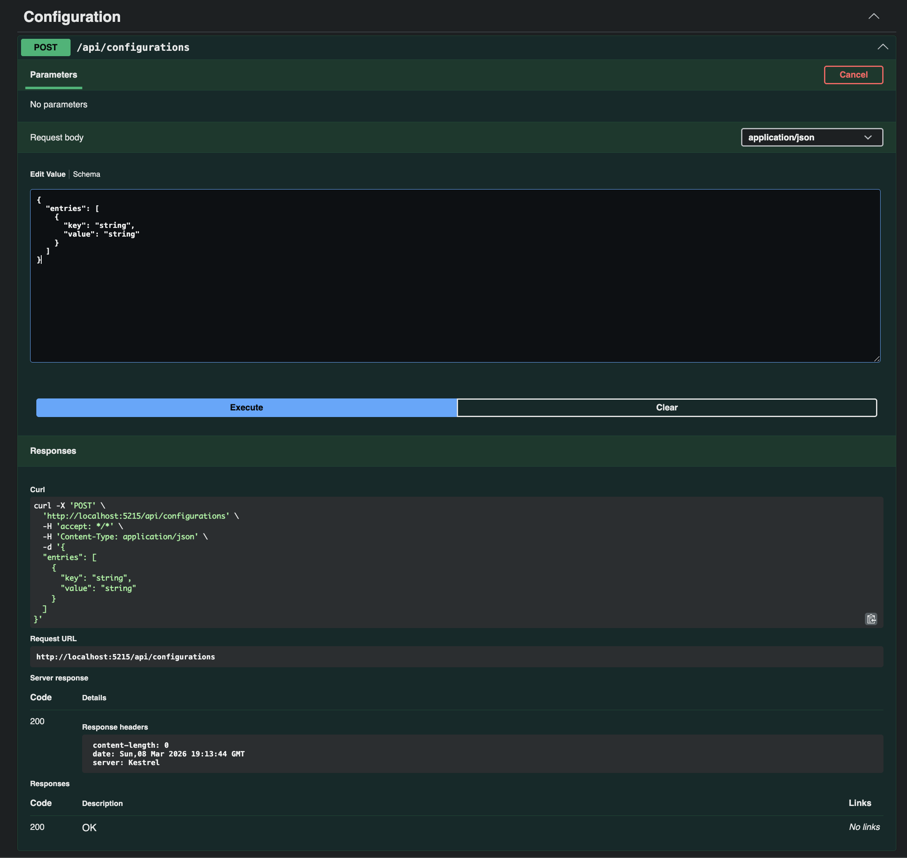
- `GET /api/configurations`  
  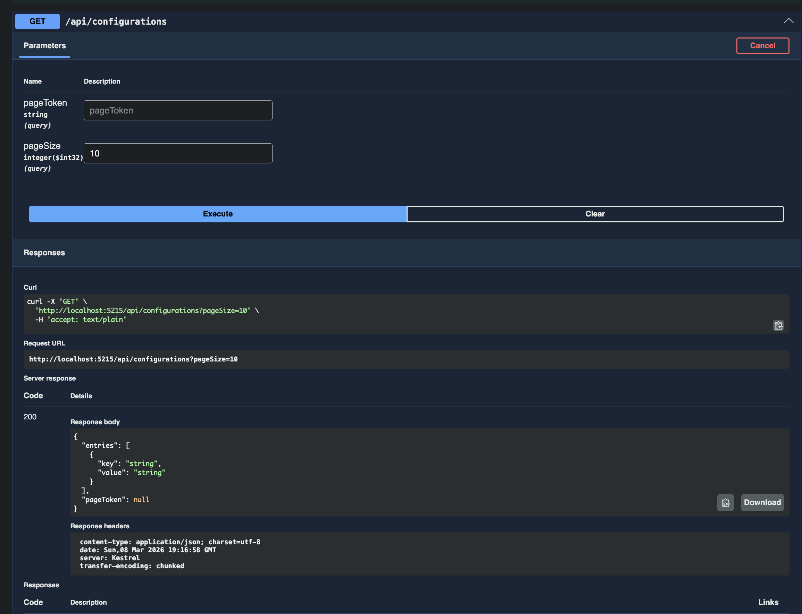

## Lab 3: Метрики и Grafana

### Добавленные custom product metrics
- `configurations_set_requests_total` - количество запросов на запись конфигураций
- `configurations_get_requests_total` - количество запросов на чтение конфигураций
- `configurations_entries_written_total` - сколько конфигураций записано через `POST`
- `configurations_entries_read_total` - сколько конфигураций отдано через `GET`
- `configurations_set_batch_size` - распределение размера батча записываемых конфигураций
- `configurations_get_result_size` - распределение размера ответа для чтения конфигураций

Дополнительно включены стандартные HTTP-метрики через `prometheus-net.AspNetCore`, а endpoint метрик доступен по `GET /metrics`.

### Инфраструктура (docker-compose)
Поднимаются сервисы:
- `postgres` - база данных приложения
- `app` - API сервиса конфигураций
- `victoriametrics` - time-series хранилище
- `vmagent` - scrape метрик и remote write в VictoriaMetrics
- `grafana` - дашборды (provisioning datasource + dashboards)

Запуск:
```bash
docker compose -f ./docker/docker-compose.yml up --build
```

Полезные URL:
- API Swagger: [http://localhost:5215/swagger/index.html](http://localhost:5215/swagger/index.html)
- Метрики приложения: [http://localhost:5215/metrics](http://localhost:5215/metrics)
- VictoriaMetrics: [http://localhost:8428](http://localhost:8428)
- Grafana: [http://localhost:3000](http://localhost:3000) (`admin` / `admin`)

### Grafana dashboard
Provisioned dashboard: `Configuration Service - Lab 3 Metrics` (folder `LR3`).

Примеры PromQL/MetricQL-запросов, используемых в панелях:
- `sum(rate(configurations_set_requests_total[5m]))`
- `sum(rate(configurations_get_requests_total[5m]))`
- `sum(increase(configurations_entries_written_total[1h]))`
- `sum(increase(configurations_entries_read_total[1h]))`
- `histogram_quantile(0.95, sum(rate(configurations_set_batch_size_bucket[5m])) by (le))`
- `histogram_quantile(0.95, sum(rate(configurations_get_result_size_bucket[5m])) by (le))`

### Скриншоты

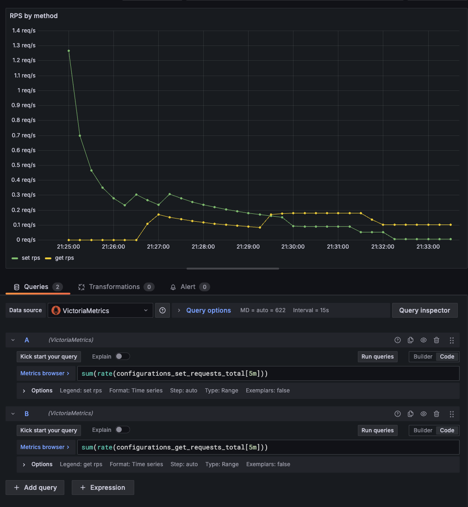

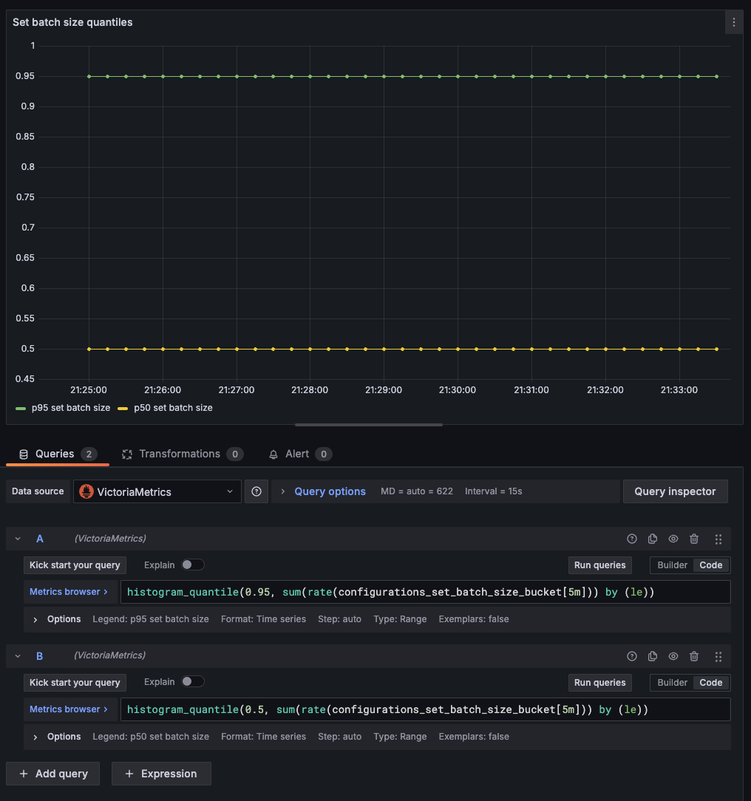

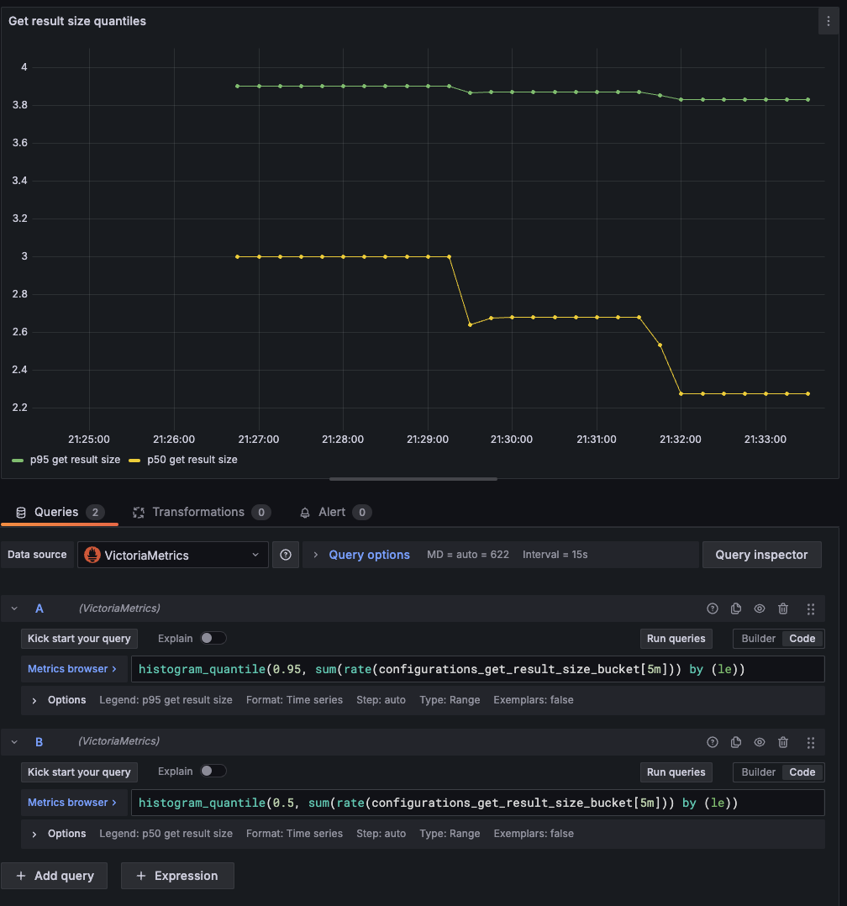

## Lab 4: Логирование и LogQL

### Стек
- Логирование в приложении: `Serilog.AspNetCore` + `Serilog.Sinks.Grafana.Loki`
- Хранение логов: Grafana Loki
- Визуализация и запросы: Grafana Explore (LogQL)

### Инфраструктура
В `docker/docker-compose.yml` добавлены/обновлены:
- сервис `loki` (`grafana/loki:latest`)
- переменная `LOKI_URL` для сервиса `app`
- datasource provisioning для Loki: `monitoring/grafana/provisioning/datasources/loki.yml`

Запуск:
```bash
docker compose -f ./docker/docker-compose.yml up --build
```

### Скриншоты ЛР4
Все логи приложения
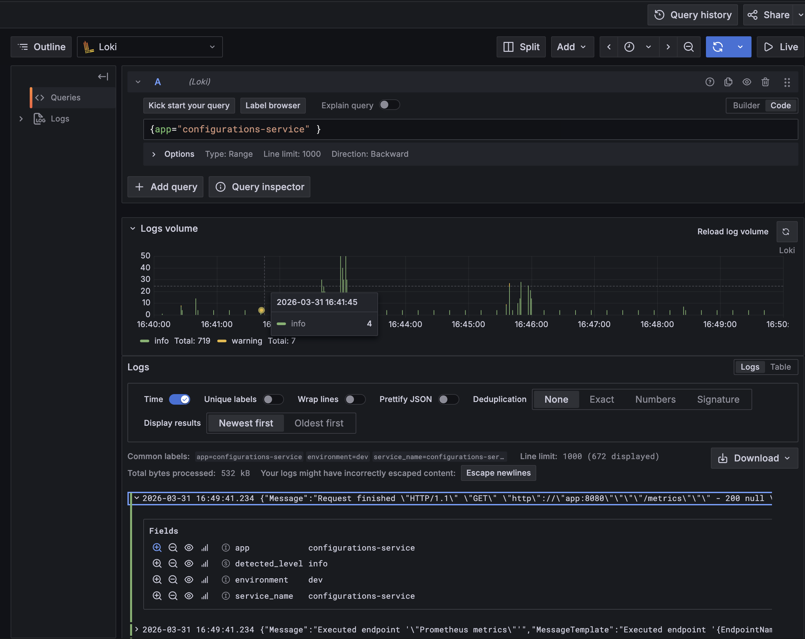

Логи об неудачных запросах
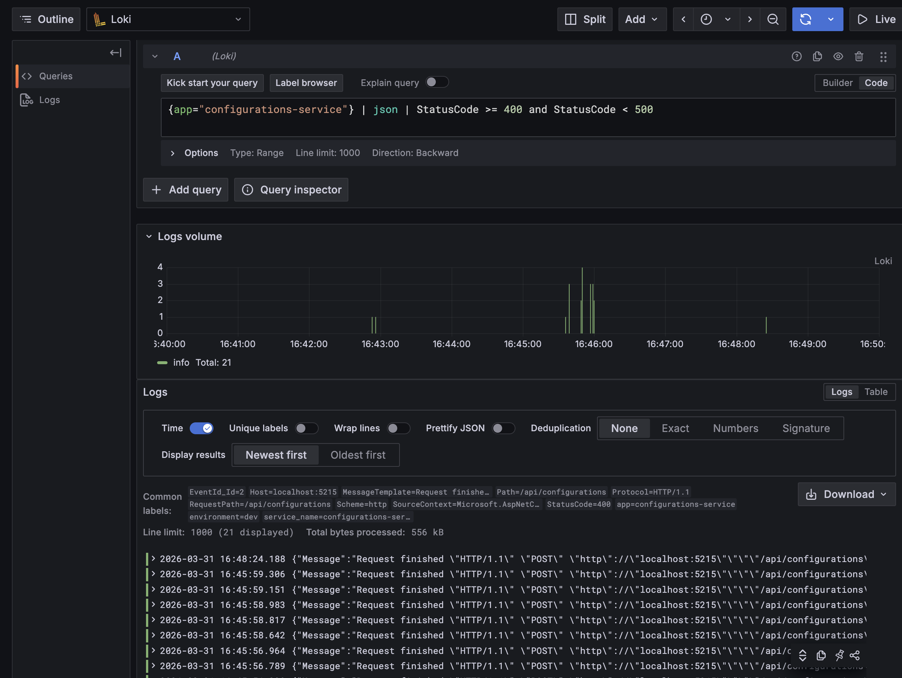

Среднее количество логов об неудачных запросах в час
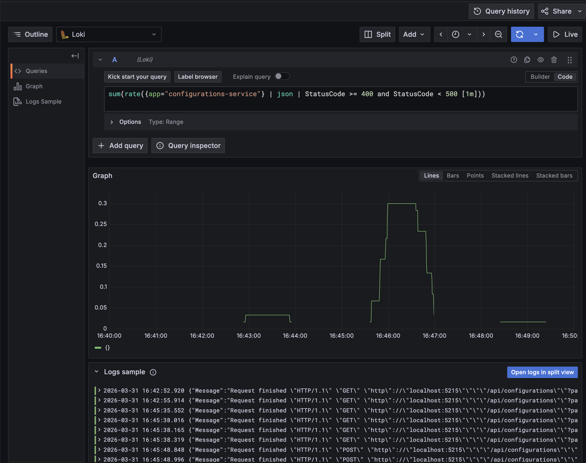

## Lab 5: Трейсы и TraceQL

### Что добавлено
- Генерация трейсов в приложении:
  - автотрейсинг ASP.NET Core запросов через OpenTelemetry
  - ручные спаны в `ConfigurationController`:
    - `configurations.set`
    - `configurations.get`
  - custom-теги для фильтрации (`configurations.entries_count`, `configurations.page_size`, `configurations.has_page_token`)
- Отправка трейсов:
  - OTLP exporter из приложения в Tempo (`OTEL_EXPORTER_OTLP_ENDPOINT`)
- Хранение и просмотр:
  - Tempo как backend для трейсов
  - Grafana Explore как UI просмотра трейсов
- Язык запросов:
  - TraceQL для поиска и фильтрации трейсов в Grafana

### Инфраструктура
В `docker/docker-compose.yml` добавлен сервис:
- `tempo` (`grafana/tempo`)

Также добавлены:
- `docker/tempo.yaml` - конфигурация Tempo
- `monitoring/grafana/provisioning/datasources/tempo.yml` - datasource Tempo в Grafana
- переменная окружения `OTEL_EXPORTER_OTLP_ENDPOINT` у `app`

Запуск:
```bash
docker compose -f ./docker/docker-compose.yml up --build
```

### Примеры TraceQL-запросов
- Все трейсы сервиса:
  - `{ .service.name = "configurations-service" }`
- Только ручные спаны записи конфигураций:
  - `{ name = "configurations.set" }`
- Только ручные спаны чтения конфигураций:
  - `{ name = "configurations.get" }`
- Запросы, где размер page > 10:
  - `{ span.configurations.page_size > 10 }`
- Запросы, где был передан page token:
  - `{ span.configurations.has_page_token = true }`
- Ошибочные спаны:
  - `{ status = error }`

### Скриншоты ЛР5
- Explore с трейсами сервиса
  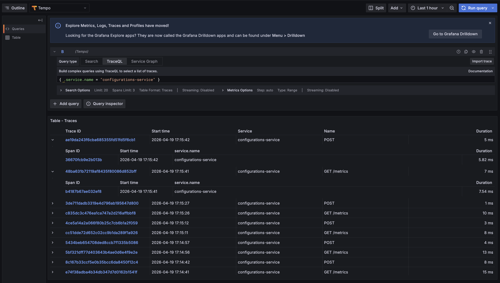
- Фильтрация через TraceQL по ручным спанам  
  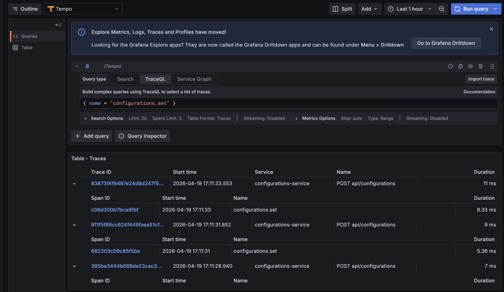
- Поиск ошибок/фильтрация по статусу  
  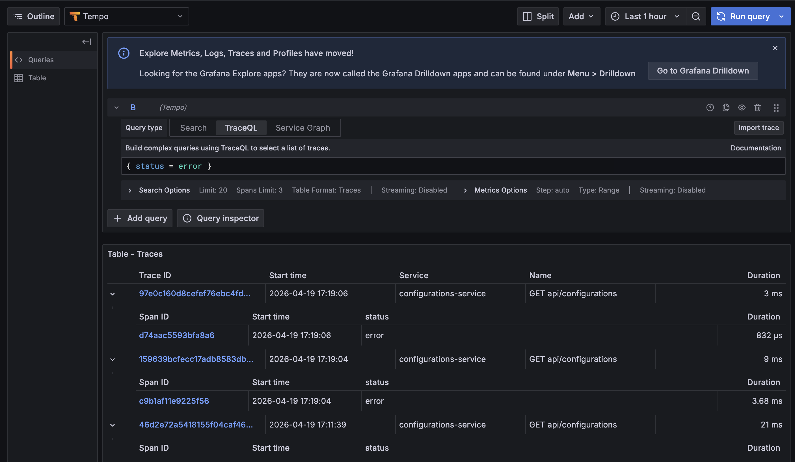

## Lab 6: CI/CD

### Пайплайн

GitHub Actions — файл [`.github/workflows/ci.yml`](.github/workflows/ci.yml).

Шаги выполняются последовательно:

| Job | Что делает |
|-----|-----------|
| **Lint** | `dotnet format --verify-no-changes` — проверка форматирования кода |
| **Build** | `dotnet build --configuration Release` — компиляция проекта |
| **Test** | `dotnet test --configuration Release` — запуск тестов |
| **Docker Build** | `docker build` — сборка Docker-образа |

Триггеры: push в любую ветку, pull request в `main`.

### Скриншоты ЛР6

Успешный прогон всех шагов:  
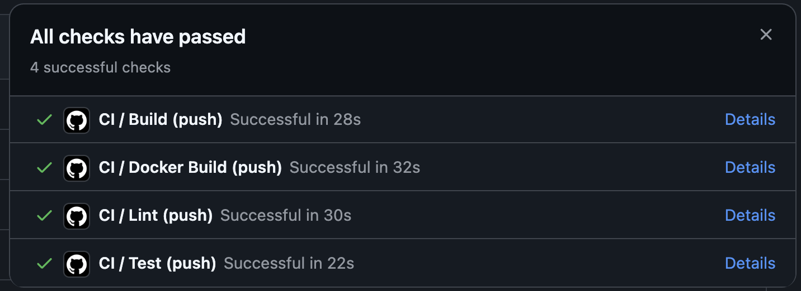

Детали шага Lint:  
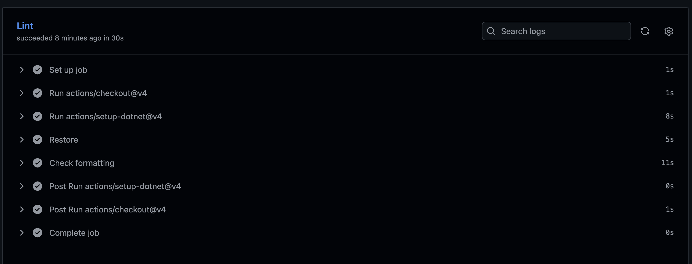

Детали шага Docker Build:  
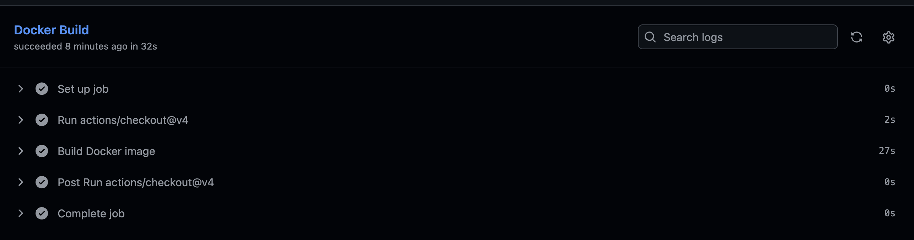
